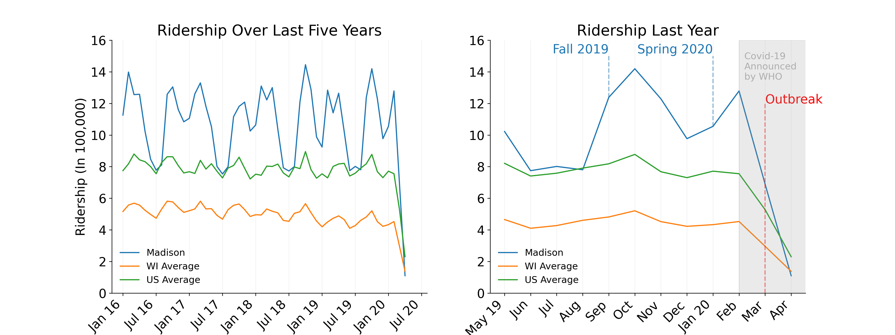
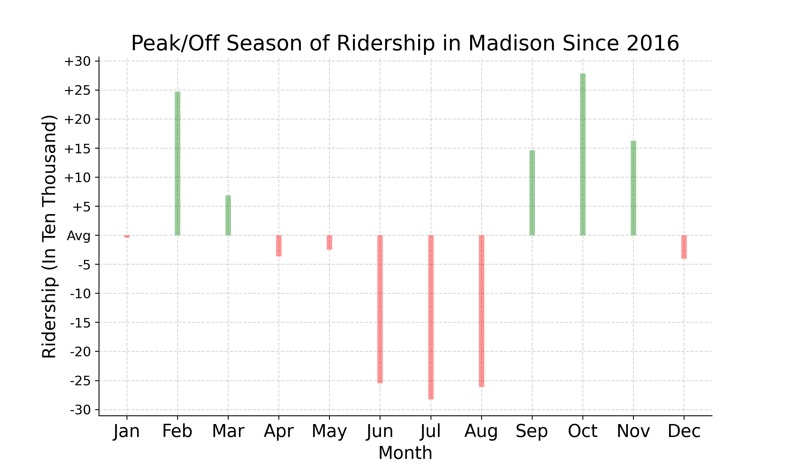

#### Before COVID-19 outbreak:

There were 63 routes in total; 30 regular routes, 22 peak-only routes, 
6 weekend-only routes, and 4 UW-Madison Campus Routes.

[Note: route 36 is not categorized]

#### After COVID-19 outbreak:

There are 47 routes available; 25 regular routes, 11 peak-only routes, 
6 weekend-only routes, and 4 UW-Madison Campus Routes.

- unavailable regular routes:  1, 3, 14, 19, 34 

- unavailable peak-only roues: 25, 28, 29, 35, 37, 38, 47, 56, 57, 58, 71

- unavailable weekend-only routes: None

- unavailable UW-Madison Campus Routes: None

**Route Network**: the route network focuses on hubs at the Capitol Square in downtown Madison 
and four major transfer points in outer parts of Madison.

## Before/After COVID-19
### Ridership

From the left plot, we observe that Madison Metro Transit has a higher volume 
of ridership than the average of Wisconsin State as well as that of the U.S. 
This makes sense because Madison is the second largest city in the Wisconsin State. 
Ridership in Madison also fluctuates more than others because school seasons affect the
number of boardings. 

Looking more closely to the recent months, we can see the rise of the ridership 
in Madison has a lot to do with the opening of the school. January 30th, 2020 was the day
when WHO started to inform the world about the outbreak, and March 11th was when we started
to quarantine, which both of them contributed to the decreasing trend. The number of ridership in Madison 
reached a peak of 1,278,838 in February; nonetheless, dropped drastically to a troughs of 
110,054 in April. 

[Note: The ridership data of Madison was last updated in April, so we only have the data available till April 2020]
 
 
   

Notice that the off season (in red) in Madison is during the summer times and in December and January; 
and the peak season (in green) is February, March, September, October, and November. The `Avg` on the 
y-axis is calculated from the mean of all ridership from January 2016 to 2020 April, and on the x-axis is 
the mean of each month.   

- trips
- covered area
- available stops
- 