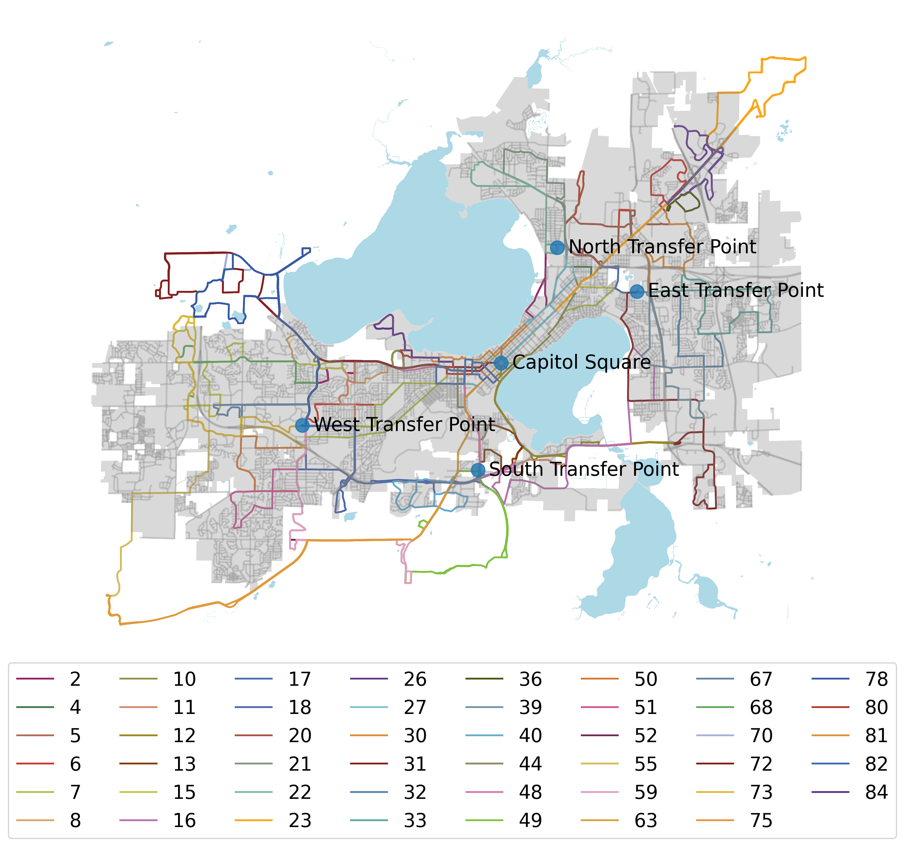
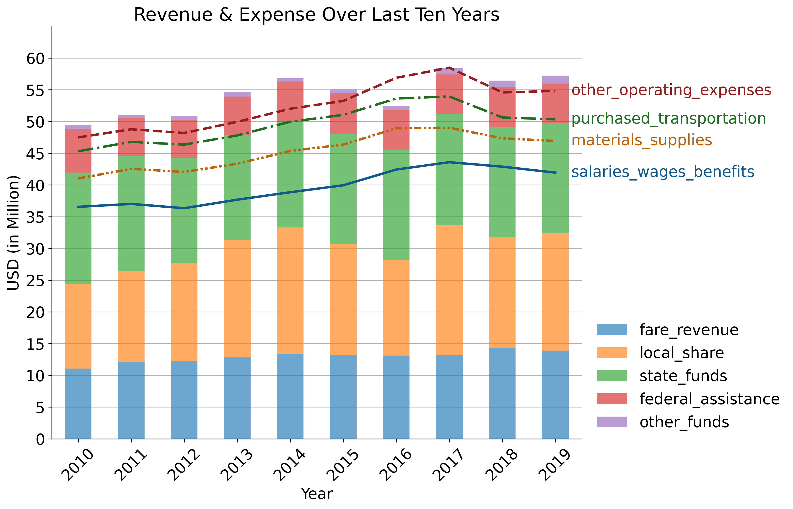
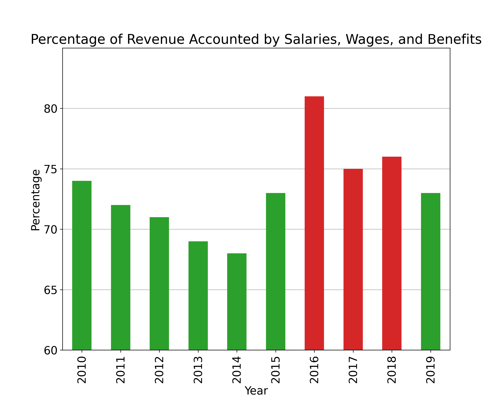

#### Before COVID-19 outbreak:

There were 63 routes in total; 30 regular routes, 22 peak-only routes, 
6 weekend-only routes, and 4 UW-Madison Campus Routes.

Routes 56, 63, 68, 78 don't provide services on regular weekdays.  

[Note: route 36 is not categorized]

#### After COVID-19 outbreak:

There are 47 routes available; 25 regular routes, 11 peak-only routes, 
6 weekend-only routes, and 4 UW-Madison Campus Routes.

Regular routes *1, 3, 14, 19, 34* and peak-only routes *25, 28, 29, 35, 37, 38, 47, 56, 57, 58, 71* 
are currently suspended due to COVID-19 to reduce the unnecessary expense while maintaining 
only the routes that are essential to the city. 

## How is The Network of Madison Metro Transit Built?  

The route network focuses on hubs at the Capitol Square in downtown Madison 
and four major transfer points in outer parts of Madison.

### Premises: 
We only consider the data for DO services, and MB (Motorbus) mode vehicles in today's report.

[**Directly Operated (DO)**:
Transportation service provided directly by a transit agency, using their employees to supply the necessary labor to operate the revenue vehicles.]

## How does Madison Metro Transit Do, Comparing With Wisconsin State and The U.S.?

From the left plot, we observe that Madison Metro Transit has a higher volume 
of ridership (more specific term, unlinked passenger trips) than the average of Wisconsin State as well as that of the U.S. 
This makes sense because Madison is the second largest city in the Wisconsin State. 
Ridership in Madison also fluctuates more than others because school seasons affect the
number of boardings. 

Looking more closely to the recent months, we can see the rise of the ridership 
in Madison has a lot to do with the opening of the school. January 30th, 2020 was the day
when WHO started to inform the world about the outbreak, and March 11th was when we started
to quarantine, in which both of them contributed to the decreasing trend. The number of ridership in Madison 
reached a peak of 1,278,838 in February; nonetheless, dropped drastically to a troughs of 
110,054 in April. 

[Note: The ridership data of Madison was last updated in April, so we only have the data available till April 2020]
 
## What Are The Time During A Year When More People Ride A Bus? 
 

Notice that the off season (in red) in Madison is mostly during the summer times and in December and January; 
and February, March, September, October, and November are the peak season (in green). The `Avg` on the 
y-axis was calculated from the mean of all ridership from January 2016 to April 2020, and on the x-axis is 
the mean of each month.   

## Does Madison Metro Transit Usually Have a Surplus Or Deficit Every Year?

During 2012 to 2013, route 70 was re-routed from Northbook Dr (in Middleton) to Parmenter Street; route 75 
was added in March 2012, significantly reduces the travel time from the Madison CBD to the Epic campus; route 
85 was deleted and absorbed into Route 80. These updates had positive impacts on the revenue of 2013.

However, during 2016 to 2017, Madison Metro Transit was in Deficit. One major cause was the 
paratransit (community transportation servicec) funding loss due to Family Care expanding into Dane County. 
This did not bring negative effect to the fare revenue of Madison Metro Transit but it put Madison Metro Transit 
in deficit for two years.

Salaries, Wages, and Benefits are the major expense of Madison Metro Transit, accounting for an average of 73.24% 
of the total revenue of that year (details ->). 

Bars that are highlighting in red color are the percetages of Salaries, Wages, and Benefits that accounts for ≥ 75% 
of the total revenue of that year. In 2016, 81% of the total revenue was spent on it as a result of the funding loss. 

## Next Week
##### TODO:
we will try to find the correlation among *fare_revenue*, *Unlinked Passenger Trips*, 
*Vehicle Revenue Miles*, *Vehicle Revenue Hours*, *Vehicles Operated in Annual Maximum Service*.

##### Objectives & Preparation for Mid-Semester Report:
Ideally, Jeremy and I are currently working on the dataset we found on National Transit Database. Our 
current goal is to evaluate the relationships between the contributions of each stop and route to 
the fare revenue and the revenue of the year. 

So, instead of looking at the overlaps of the routes (which I think Megan and Ray are working on), 
Jeremy and I will be looking at other factors that potentially could cause the rise/fall in the revenue trend
(not purely by route overlaps or adjacent stops). In addition, we'll also be interested in working with 
the Madison Metro Simulator, so I really hope we can all meet in Thursday morning. 