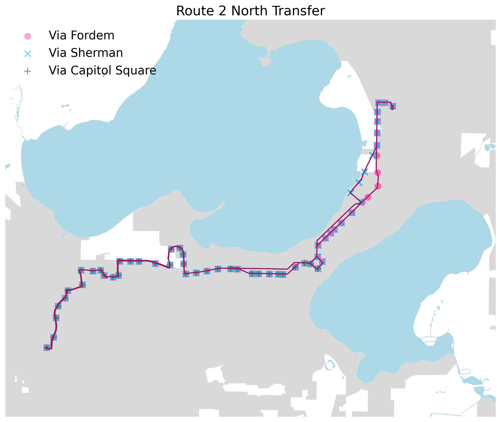

<kbd>BEGIN [Andy][Andy]</kbd>
## Available Routes by Service Types

  
Details

  
  ##### On weekdays
  - routes [59, 63, 68, 78] do not provide services
  ##### On Saturdays
  - routes [10, 11, 12, 15, 23, 27, 33, 39, 44, 48, 49, 52, 55, 70, 72, 73, 75, 84] do not provide services
  ##### On Sundays
  - routes [10, 11, 12, 15, 23, 27, 33, 39, 44, 48, 49, 52, 55, 70, 72, 73, 75, 84] do not provide services
  ##### On holidays
  - routes [10, 11, 12, 15, 23, 27, 33, 39, 44, 48, 49, 52, 55, 70, 72, 73, 75, 78, 81, 82] do not provide services
  ##### On modified weekdays
  - routes [10, 11, 12, 15, 23, 27, 33, 39, 44, 48, 49, 52, 70, 72, 73, 80, 81, 82, 84] do not provide services

## route 2

#### north transfer on wkd
- 1  trip  for Capitol Square
- 18 trips for north transfer via Sherman
- 17 trips for north transfer via Fordem

#### north transfer on sat and sun
- 1  trip  for Capitol Square
- 17 trips for north transfer via Sherman
- 16 trips for north transfer via Fordem

#### west transfer on wkd
- 17 trips for north transfer via Sherman
- 19 trips for north transfer via Fordem

#### west transfer on sat and sun
- 16 trips for north transfer via Sherman
- 18 trips for north transfer via Fordem

index | trip_id | stop_sequence | stop_id | arrival_time | departure_time	| shape_dist_traveled	| full_headsign | stop_lat | stop_lon	| DailyBoard
:---: | :---: | :---: | :---: | :---: | :---: | :---: | :---: | :---: | :---: | :---:
77 | 1007844 | 1 | 6100 | 6:00:00 | 6:00:00 | 0.0097 | NORTH TRANSFER: VIA FORDEM	| 43.053883	| -89.475098	| 199.04    
78 | 1007844 | 2 | 2925 | 6:01:02 | 6:01:02 | 0.3175 | NORTH TRANSFER: VIA FORDEM	| 43.056418	| -89.472755	| 7.45      
79 | 1007844 | 3 | 2401 | 6:02:12 | 6:02:12 | 0.6611 | NORTH TRANSFER: VIA FORDEM	| 43.061234	| -89.471956	| 10.57     
80 | 1007844 | 4 | 2249 | 6:02:55 | 6:02:55 | 0.8757 | NORTH TRANSFER: VIA FORDEM	| 43.064090	| -89.471242	| 6.79      
81 | 1007844 | 5 | 2669 | 6:03:32 | 6:03:32 | 1.0579 | NORTH TRANSFER: VIA FORDEM	| 43.066034	| -89.468873	| 2.23      
... | ... | ... | ... | ... | ... | ... | ... | ... | ... | ...       
1953 | 1007482 | 53 | 1715 | 22:42:19 | 22:42:19 | 10.0604 | NORTH TRANSFER: VIA FORDEM	| 43.109495	| -89.363707	| 1.00      
1954 | 1007482 | 54 | 1561 | 22:42:58 | 22:42:58 | 10.2226 | NORTH TRANSFER: VIA FORDEM	| 43.111841	| -89.363667	| 2.34      
1955 | 1007482 | 55 | 1877 | 22:43:43 | 22:43:43 | 10.4115 | NORTH TRANSFER: VIA FORDEM	| 43.114124	| -89.363344	| 1.56      
1956 | 1007482 | 56 | 1759 | 22:44:10 | 22:44:10 | 10.5258 | NORTH TRANSFER: VIA FORDEM	| 43.114105	| -89.361072	| 1.11      
1957 | 1007482 | 57 | 5100 | 22:45:00 | 22:45:00 | 10.7180 | NORTH TRANSFER: VIA FORDEM	| 43.113253	| -89.358540	| 172.90    

<kbd>END</kbd>

[Ray]: https://github.com/RaenonX
[Andy]: https://github.com/yayen-lin
[Jeremy]: https://github.com/jmsusanto
