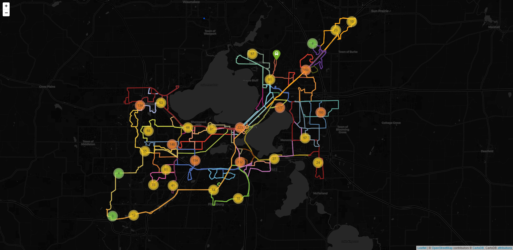
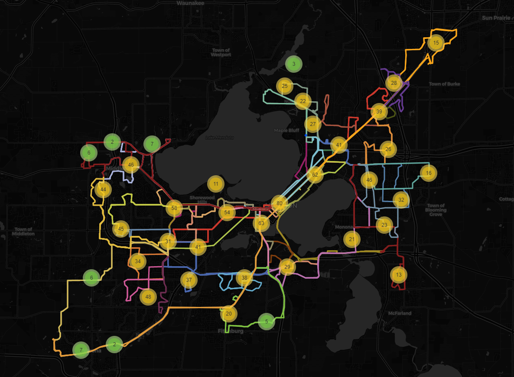

# 2020/09/21

## Stops which does not have ridership data

We found that despite these stops exist, they do not have the ridership data. 

Because the ridership data used in this program is collected in Mar 2019, 
we assume that these stops were deployed after the data collection date.

List of stops (69) that do not have ridership data

These are sorted by stop ID.

- \#0043 - W Dayton & N Lake (EB)
- \#0196 - S Mills & Regent (SB)
- \#0362 - S Park & W Olin (SB)
- \#0537 - W Johnson & Wisconsin (EB)
- \#0585 - Regent & S Orchard (EB)
- \#0731 - N Mills & Regent (NB)
- \#0743 - W Johnson & N Mills (EB)
- \#0750 - Spring & N Park (WB)
- \#0752 - E Gorham & N Butler (WB)
- \#0914 - W Gorham & Wisconsin (WB)
- \#1110 - E Dayton & Wisconsin (WB)
- \#1111 - W Doty & M L K Junior (EB)
- \#1124 - S Fairchild & W Main (SB)
- \#1126 - Division & Eastwood (SB)
- \#1135 - N Webster & E Mifflin (NB)
- \#1137 - Milwaukee & Corry (EB)
- \#1140 - E Washington & N Webster (WB)
- \#1146 - N Fairchild & W Washington (SB)
- \#1155 - S Webster & E Main (NB)
- \#1174 - W Dayton & State (WB)
- \#1189 - E Doty & S Pinckney (EB)
- \#1219 - Atwood & Waubesa (EB)
- \#1227 - E Johnson & N Butler (EB)
- \#1327 - Atwood & S Fair Oaks (EB)
- \#1384 - Atwood & Division (WB)
- \#1448 - Rutledge & Rogers (WB)
- \#1593 - N Franklin & E Johnson (NB)
- \#1622 - Atwood & Oakridge (NB)
- \#1662 - E Gorham & N Blount (WB)
- \#1718 - Atwood & S Fair Oaks (WB)
- \#1726 - Oakridge & Atwood (WB)
- \#1746 - Milwaukee & Corry (WB)
- \#1848 - Milwaukee & Starkweather (WB)
- \#1894 - Atwood & Waubesa (WB)
- \#1907 - Atwood & Oakridge (SB)
- \#1919 - Milwaukee & Starkweather (EB)
- \#1963 - Atwood & Winnebago (EB)
- \#2094 - Walnut & Observatory (SB)
- \#2248 - Toepfer & Birch (SB)
- \#2437 - Toepfer & Birch (NB)
- \#2502 - Walnut & G Pinchot (SB)
- \#4000 - South Transfer Point
- \#4175 - Fish Hatchery & Pike (NB)
- \#4260 - Mckee & Kapec (WB)
- \#4268 - Post & Latham (WB)
- \#4415 - Stewart & Latham (EB)
- \#4485 - Mckee & Fitchrona (EB)
- \#4555 - W Verona & Westridge (EB)
- \#4777 - Verona & Highway Ramp (EB)
- \#4790 - Fish Hatchery & Greenway (SB)
- \#4844 - Fish Hatchery & Pike (SB)
- \#4886 - Greenway & Bryant (WB)
- \#4910 - Post & Index (WB)
- \#4955 - Greenway & Fish Hatchery (EB)
- \#4995 - Mckee & Kapec (EB)
- \#5000 - North Transfer Point
- \#5244 - Packers & Tennyson (SB)
- \#5546 - Packers & Scott (SB)
- \#6000 - West Transfer Point
- \#7000 - East Transfer Point
- \#7156 - Acewood & Starker (SB)
- \#7198 - Milwaukee & Milo (WB)
- \#7334 - Cottage Grove & North Star (WB)
- \#7704 - Dempsey & Hynek (SB)
- \#7842 - Milwaukee & Portland (WB)
- \#8537 - Schroeder & Chapel Hill (EB)
- \#8733 - S Gammon & Watts (NB)
- \#8770 - Hammersley & Whitcomb (WB)
- \#9000 - East Towne Mall

 

## Better conception of the count of stops in the city

### Before (09/14)

### After (09/21)

Comparing to the previous week (09/14), we grouped the stops located on the same cross, according to MMT GTFS data.

The count of the stops in a region is much more accurate than the previous one, 
because the same stop with different direction is now counter as one (1) instead of two (2).

This still needs to be improved, because some stops that were supposed to be grouped were not grouped.

For example, the stops on E Gorham St. and E Johnson St. were separated, 
because both of these streets are single-way streets.
Using the current algorithm, stops on these streets are being counted as 2 for a single intersection instead of 1 
(Check the image below).

