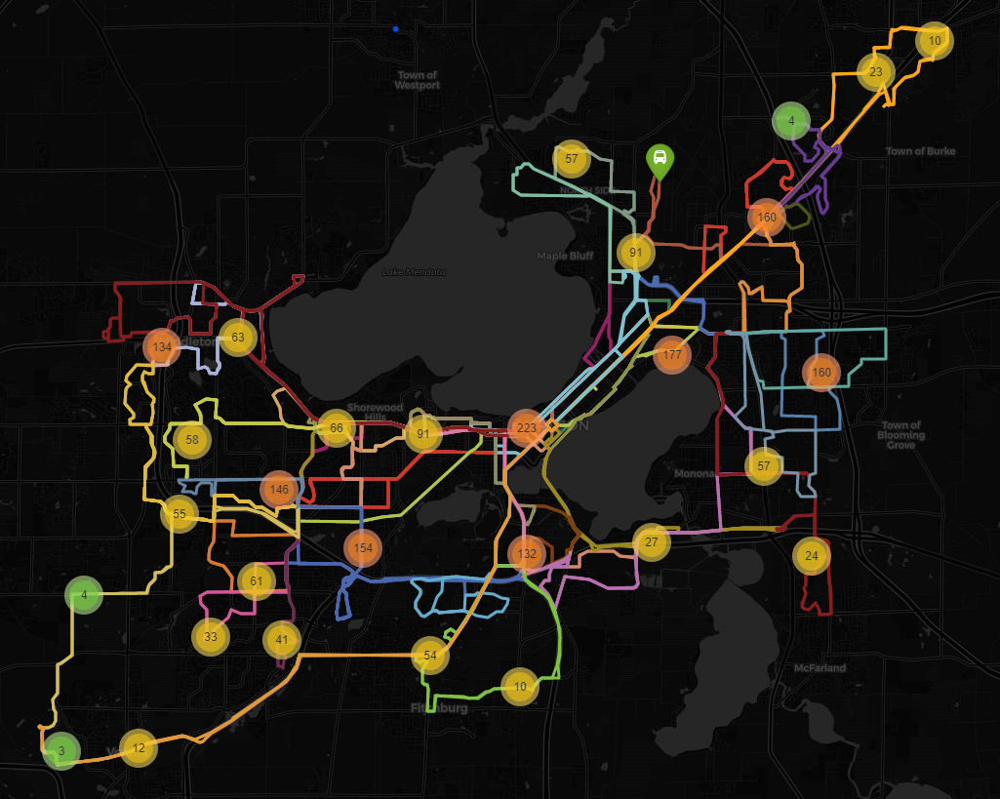

# 2020/09/21

## Bus stop and route coverage of the Madison City

This shows the bus route coverage of the Madison city, also with the stop density.

Most stops are around Washington avenue and the campus area, which is expected.

## Possibly too-dense stop area

If we zoom in to the campus area, we can see that in this small region, we got 111 stops 
(55.5 actually, because same stop in different direction will be considered as 2) in such small area.

It seems that some stops could potentially being merged to reduce the redundancy.
