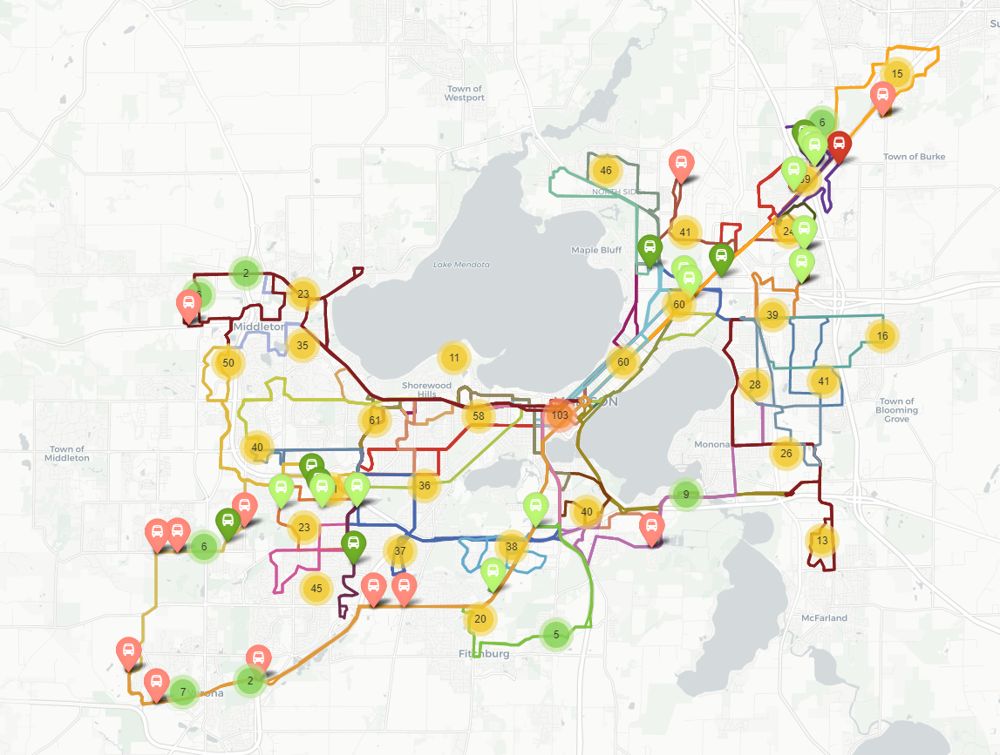
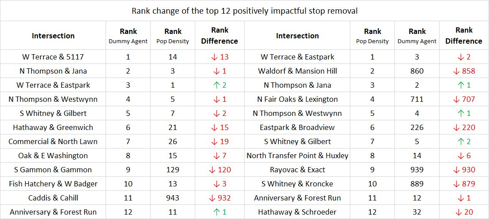
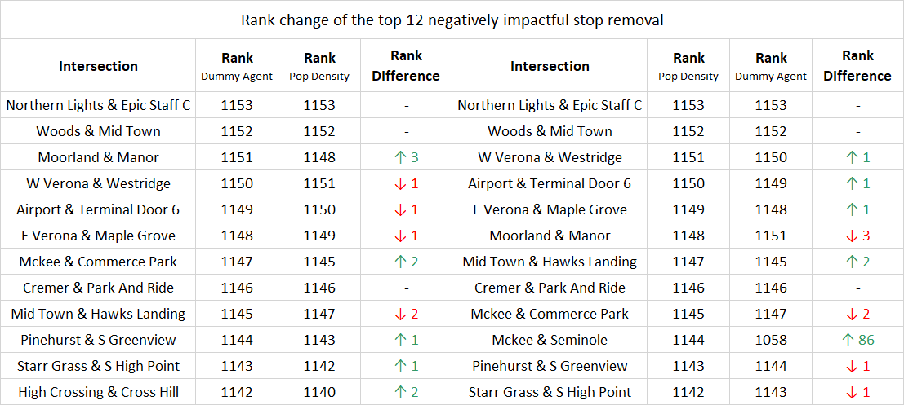
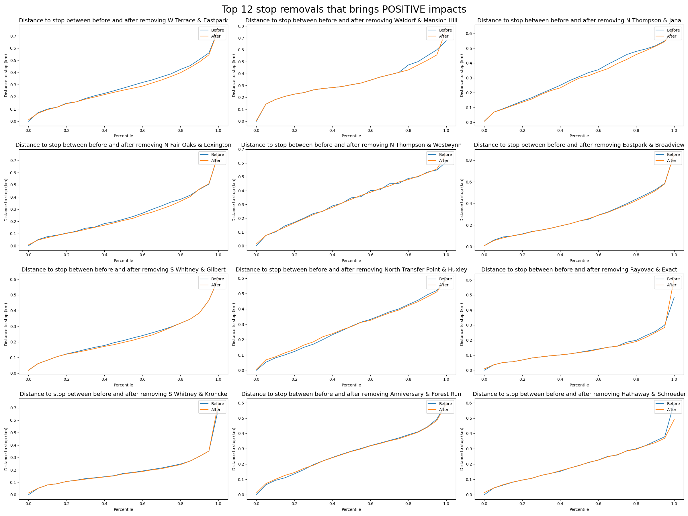
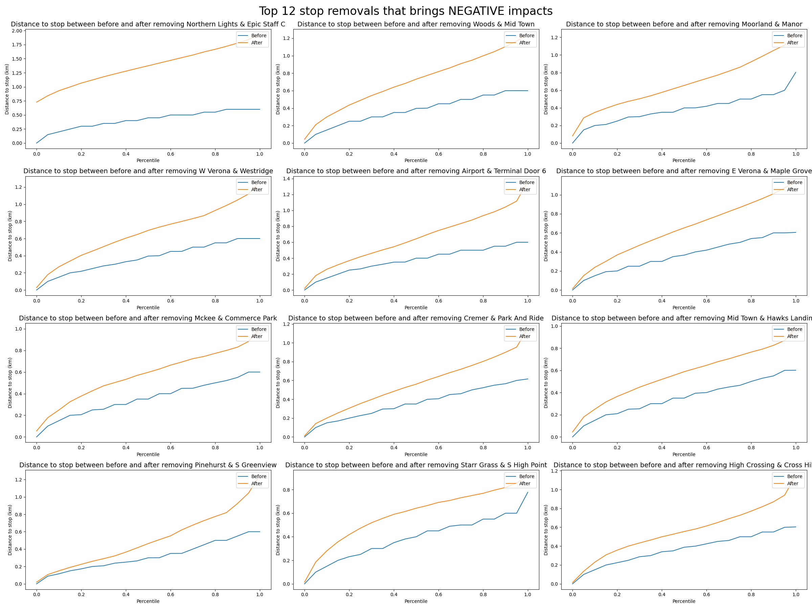

## 2020/10/12

-------

# Stop Removal with Population Density

<kbd>BEGIN [Ray][Ray]</kbd>

Last week, we were using dummy agents, which were distributed almost equally. 

However, the impact index and accessibility measurement may be inaccurate, 
because, in reality, people are just not living under the same density.

Therefore, we incorporated the population data (thanks to [Jeremy][Jeremy] for providing the data) of Madison to get a better prediction.

> Check the **Population Projection** section for the explanation on how it works

## Comparison between 2 methodologies

### Overview

This map has the location of the top 12 positively/negatively impactful stop removal for both analyzing methodologies, dummy agents, and population density.

Also, it gives a rough idea of the stop density.

- Light Green/Red: Locations of top 12 positively/negatively impactful stop removal using dummy agents

- Green/Red: Locations of top 12 positively/negatively impactful stop removal using population density

The map indicates that:

- Despite the stop density around State Capitol is relatively high, 
  it seems that the stops prioritized to remove are not around there, even around Washington Avenue.
  
- At the "both ends" of Washington Avenue, some stops could be prioritized to remove.

- For farther points, the stops then mostly should **NOT** be removed, which seems to be reasonable 
because they've already had difficulty accessing the metro system. If the stops were removed, it would be much harder for them to access.
  
- The area of could-be-removed-stops and should-not-be-removed-stops seem to be almost the same between the 2 methodologies.

### Impact rank comparison

To observe if the newly added factor, population, really matters, 
we compared the rank for each data in the TOP 12 for both positive and negative against its counterpart.

#### Top 12 positively impactful stop removal rank change

#### Top 12 negatively impactful stop removal rank change

From these tables, we can observe that:

- There are significant rank shifting happening between these two methodologies 
  for positively impactful stop removals (removing redundant stops).
  
- In contrast, the analysis for negatively impactful stop removals does not change a lot.

Therefore, we could say that using the population density method; we may be able to:

- Find stops that could be removed, because there will only be a few people using it, and they've already had some alternatives for accessing the metro.
  
- Find stops that originally was listed to be removable, but turns out that the region might overload
  (each stop will need to take more riders/passengers generally need to travel more to access) if the stop was removed.
  
May not be able to:

- Identify false negatives, which means that the stop was marked as "not recommended to remove," but actually can be removed.

  - Or it's just because these 2 methodologies have the same flaw OR they've already ruled out the false negatives.
  
### Possible "aftermath" if a stop was removed

#### Top 12 positively impactful stop removal

From this matrix plot, we can know that for positive impacts, 
the distances for passengers to travel to their closest stop almost remain the same.

#### Top 12 negatively impactful stop removal

In contrast to the positively impactful stop removal matrix plot, 
almost all agents living near the stop will need to travel a lot more to reach their closest stop.

## Population Projection

**This section talks more about methodology than analysis.**

The population data we are using for now actually is just a combination of multiple rows. 
Each row has a coordinate with a corresponding population number (which seems to be something like density).

Because we can't directly use such data to find the density for all arbitrary point (coordinate), 
we need to find some way to project that. By doing so, we will then be able to access the population density at any point.

The way we do it is to get 3 ward points that are closest to the requested coordinate. 
Then, use these points to form a 3D plane, 
so that we can just provide a coordinate `(X, Y)` (`(lat, lon)`) to get `Z` (`population density`) back.

<kbd>END</kbd>

<kbd>BEGIN [Andy][Andy]</kbd>

<kbd>END</kbd>

[Ray]: https://github.com/RaenonX
[Andy]: https://github.com/yayen-lin
[Jeremy]: https://github.com/jmsusanto
