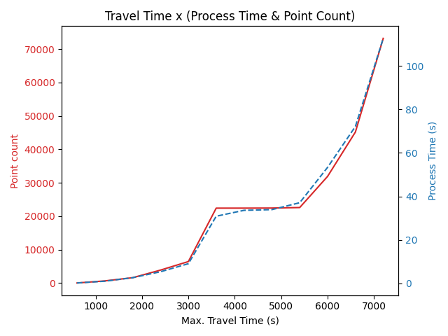
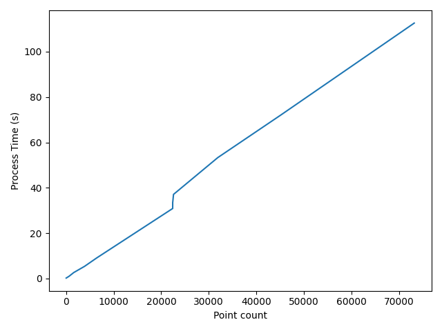
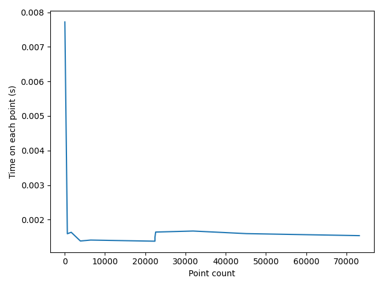
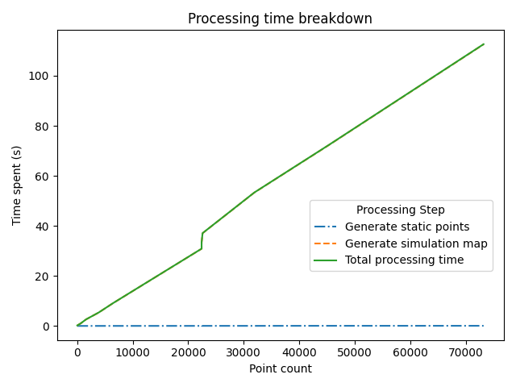
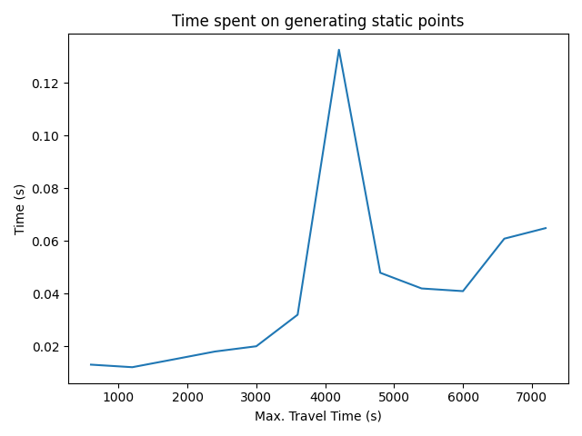

## 2020/11/09

--------

<kbd>BEGIN [Ray][Ray]</kbd>

# Map generation performance of the initial simulator

The following performance plots are based on the following configuration:

- Starting coordinate: `(43.069451, -89.401168)` - Close to Merit Residence Hall of UW-Madison
- Starting time: `2020/09/02 PM 3:00 CDT`
- Bus Movement Speed: `16.7 km/h (10.38 mi)`
- Walking Speed: `4.2 km/h (2.610 mi)`
- Max. Walking Distance: `0.7 km (0.435 mi)`
- Max. Waiting Time: `900 s (15 mins)`

## Travel Time x (Process Time & Point Count)

This figure inspects the relationship between the simulation map point count (i.e. map size) and the time spent on 
generating the simulation map in different configured max travel time.

We observe that:

- The map generation time grows exponentially.

- It takes < 1 seconds for a Max. Travel Time < ~1000 secs (16 mins).

- The map point count determines the map processing time.

- For a higher Max. Travel Time, the point count grows exponentially, because the possible travel paths also grows
  exponentially given a bigger time frame.
  
There is an anamoly at Max. Travel Time = 3500 s ~ 5500 s, which we assume that it is caused by the bus schedule.
Most of the buses that are available in the other time are not available during that timeframe, causing this anamoly.

In the following plots, we will continue observing such anamoly.
  
## Point Count x Process Time

This figure verifies that the map point count determines the map generation / processing time.

We can observe that the line in the plot is linear (excepting the anamoly mentioned above), hence verifying that 
the count of points in the map determines the map generation process time.

## Point Count x (Point / Time)

This figure inspects the average time spent on a single map point.

We can observe that the average time spent on a single map point is almost consistent with 
different count of map points.

However, this figure has 2 anamolies:

- Map with a few points

- The one mentioned above

We think that the cause of the spike of the 1st anamoly is because that the benchmarking was executed sequentially,
the program was "warming-up," causing the spike. We did not verify that, although we can by reversing the benchmarking 
process, because the impact will be nullified if we check the overall performance breakdown (next figure).

## Processing Time Breakdown

This figure inspects the time spent on each map generating steps.

The map generation step could be separated to 2 smaller steps:

1. Generating static points

  - Static points are a location in a certain time frame. For example, a bus arrives and departs at a stop, 
    an agent waits at a stop.
    
2. Generating simulation map

  - Find a reasonable way to transition from a static point to another static point, i.e. connect the points.
    
    For example, assuming we have a static points template containing A and B. 
    
    A is a stop which a bus will arrive at 12:00 and depart at 12:01; 
    B is a stop which a bus will arrive at 12:05 and depart at 12:06.
    
    The generation map will then connect A to B by having a movement event: bus trip, which means that a bus will 
    load/unload passengers at A, then go to B and load/unload passengers.
    

We can observe that the simulation map generating step dominates the whole processing time. Also, the time spent on 
generating the map points is growing linearly as observed before.

## Static point generation time

Because the previous figure cannot show if the static point generation time will be affected by the Max. Travel Time, 
we created this figure to inspect if Max. Travel Time matters.

We can observe that the time spent on generating static points grows linearly to the Max. Travel Time, disregarding 
the anamoly.

This anamoly seems not directly related to the anamoly that we have seen a few times, because it only spikes at Max. 
Travel Time = 4200 secs, whereas the "frequent" anamoly occurred in the range of Max Travel Time = 3500 s ~ 5500 s.

The reason of this spike is unknown, since generating map points is basically just filtering the stop schedule for now.
Also, we are not running a cross-day simulation, so it will not be caused by the data re-parse for different date.

Despite of this, in terms of the total performance, this is very unlikely to cause any problems, because that 
according to the previous figure, a 0.02, 0.06 or 0.12 seconds time consumption is comparatively small in the overall 
time consumption.

## Summary

- The map point count determines the map generation time.

- Time consumption for each map point is almost the same.

- The program takes most of the time generating the simulation map, i.e. connecting the points.

The reason of not making a Point Count x Time on Static Points plot is because that point count is not related to the 
static points generation. Static points will be generated before generating the map. Therefore, they are in a 
sequential relationship, not affecting each other. A large map applied with a few static points or a small map applied 
with many static points is possible and reasonable.

## Appendix - Performance summary table

Max. Travel Time (s) | Process Time (s) | Point Count | Point / s
:---: | :---: | :---: | :---:
600 | 0.208 | 27 | 0.0077
1200 | 1.028 | 645 | 0.0016
1800 | 2.630 | 1609 | 0.0016
2400 | 5.375 | 3885 | 0.0014
3000 | 9.072 | 6433 | 0.0014
3600 | 30.879 | 22417 | 0.0014
4200 | 33.597 | 22421 | 0.0015
4800 | 33.9111 | 22445 | 0.0015
5400 | 37.099 | 22595 | 0.0016
6000 | 53.317 | 31901 | 0.0017
6600 | 72.125 | 45181 | 0.0016
7200 | 112.615 | 73211 | 0.0015

<kbd>END</kbd>

# Plan for the next week

- Get the metrics of distance reached for a single simulation

- Get the metrics of travel score (wait %, bus %), etc.

[Ray]: https://github.com/RaenonX
