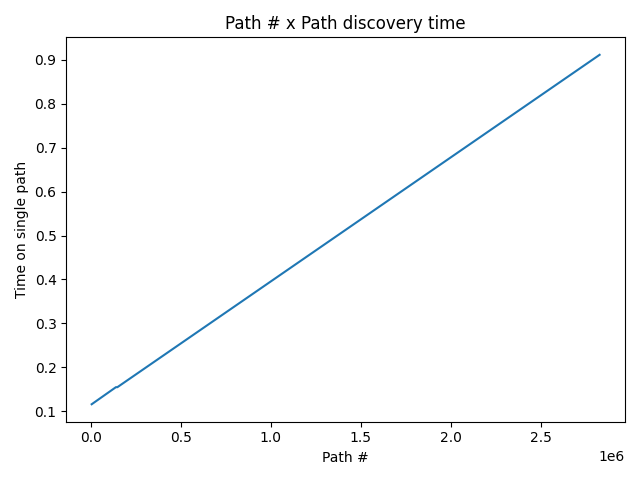
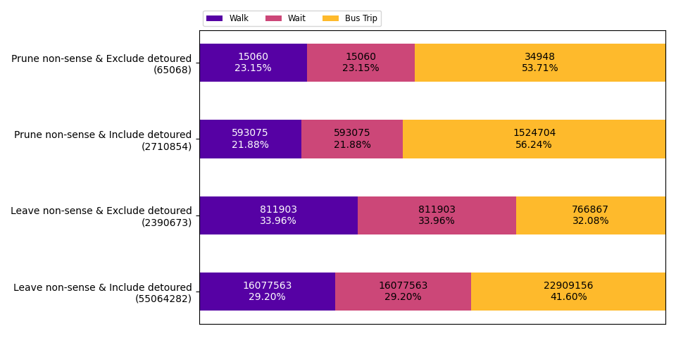
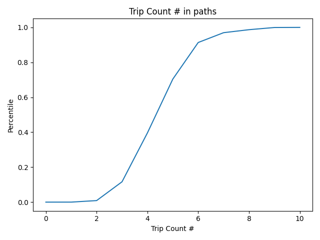
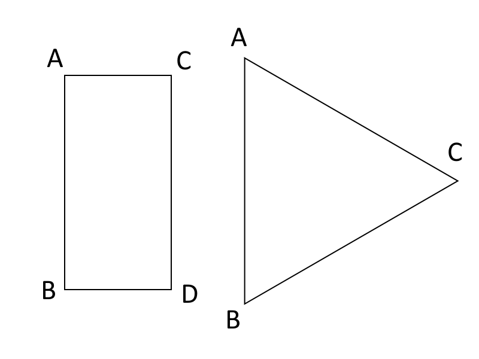

## 2020/11/16

--------

<kbd>BEGIN [Ray][Ray]</kbd>

# Path discovery of the simulator

The following performance measurements are based on the following configuration:

- Starting coordinate: `(43.069451, -89.401168)` - Close to Merit Residence Hall of UW-Madison
- Starting time: `2020/09/02 PM 3:00 CDT`
- Walking Speed: `4.2 km/h (2.610 mi)`
- Max. Travel Time: `1800 s (30 mins)`
- Max. Walking Distance: `0.7 km (0.435 mi)`
- Max. Waiting Time: `900 s (15 mins)`

> All parameters remain same, except the bus movement speed was removed because the bus schedule determines it.

## Map construction time with pruning

This inspects the map construction performance in different stages under different pruning conditions.

Prune non-sense | Exclude detoured | Point generation | Map generation | Path discovery | Total
:---: | :---: | :---: | :---: | :---: | :---:
True | True | 0.041 | 5.080 | 0.517 | 5.637
True | False | 0.021 | 4.981 | 21.640 | 26.642
False | True | 0.054 | 4.892 | 22.736 | 27.682
False | False | 0.022 | 4.757 | 2578.556 | 2583.335

> Time Unit: seconds (secs)

We can observe that without any pruning condition, time spent on path discovery will be significantly longer than 
giving either one of the pruning conditions (prune non-sense or excluding detoured paths).
If both pruning conditions are set, the performance boost will be a whopping ~5000x, 
comparing to setting only a single condition, which only gives ~110x performance boost.

This indicates that if we prune the non-sense paths and the detouring paths, not only the simulation performance will 
be way a lot better, but also the result will be closer to the reality. 
Optimizing the map construction performance is win-win.

> The [definition of non-sense](#appendix---definition-of-non-sense) and the 
[definition of detouring](#appendix---definition-of-detouring) are presented as appendices below.

## Path # x Path discovery time

This inspects average time spent on each path under different pruning conditions.

Prune non-sense | Exclude detoured | Path # | Path / s
:---: | :---: | :---: | :---:
True | True | 4461 | 0.1159
True | False | 139706 | 0.1549
False | True | 147010 | 0.1547
False | False | 2828481 | 0.9116

> Time Unit: milliseconds (ms)

Despite that we only have 4 data points, we could easily observe that the processing time for each single path 
grows linearly in respect to the total path count. 
We also observed this kind of processing slowdown during path discovery.

According to this fact, we can furthur know that the processing time will grow exponentially if the path count grows.

## Path # x Pruning Rate

This checks if the path pruning rate will be affected by the inclusion/exclusion of the detouring paths.

We defined the path pruning rate as `pruned path # / discovered #`, 
which we can understand it as "for each discovered path, there are n paths that are being pruned during discovery."

To inspect if the prune rate will be affected by tweaking the detouring exclusion parameter, 
we will tweak the starting time (hour only) of the simulation configuration here for more data.

Starting hour | Exclude detoured | # Path Discovered | # Path Pruned | Prune Rate
:---: | :---: | :---: | :---: | :---:
13 | True | 5341 | 8969 | 1.6793
13 | False | 115860 | 163324 | 1.4097
15 | True | 4461 | 10365 | 2.3235
15 | False | 139706 | 229861 | 1.6453
17 | True | 5354 | 8461 | 1.5803
17 | False | 176803 | 248705 | 1.4067
19 | True | 5005 | 9378 | 1.8737
19 | False | 124028 | 155262 | 1.2518

We observed that despite the pruning rate itself alone does not seem to have any informational meanings, 
the pruning rate of excluding the detouring paths seems always higher than including the detouring paths.

For now, this information seems to be meaningless. It could be meaningful after deeper investigation, 
but we currently do not have any plan on this.

## Move event distribution

This checks the move event distribution under different pruning conditions.

We can observe that:
  
- If non-sense paths are allowed, more unnecessary walk and wait events appear. 
  This indicates that if the non-sense paths are pruned, "wasteful" transfers will be reduced.
  We can verify this by observing that the ratio of walk and wait combined is reduced if we prune non-sense paths. 

- The count of wait and walk events are the same, 
  which means that for every transfer, a walk and a wait event **must** happen synchronously.
  However, this seems weird because same stop transfer should be a possible scenario. 
  We plan to investigate this deeper in the next few weeks.

## Detouring path ratio

This inspects the ratio of the detouring paths in all discovered paths if we include it.

Because it takes approx. 45 mins to construct a map without any pruning conditions, 
we only uses the parameters given at the beginning of the section to construct a map 
with detouring paths to be always included and non-sense paths to be either pruned or left.

Non-sense Path | Path # | Detouring Path # | Non-detouring Path # | Detouring Path %
:---: | :---: | :---: | :---: | :---:
Pruned | 139706 | 126859 | 12847 | 90.804%
Left | 2828481 | 2540350 | 288131 | 89.813%

We can observe that if we do not exclude the detouring paths, 
we will get a lot of paths which most likely will not be meaningful.

If we exclude the detouring paths, we should get a 100x performance boost (`(1/0.1)**2`),
which we have already [verfied](#map-construction-time-with-pruning) earlier.

The [definition of detouring paths](#appendix---definition-of-detouring) can be found in the appendices.

## Bus trip # taken in a single path

This checks the distribution of the count of bus trips taken for each path in a single map.

We pruned non-sense paths and excluded detouring paths here to let the result being closer to the reality.

We can observe that most of the paths are taking 3 ~ 5 distinct trips.

This means that if we limit the count of transfers, 
we could further improve the simulation performance, also to make the result being closer to the reality, 
considering the fact that people usually will not like to take too many transfers in a single trip.

Our assumption is that if we limit the max trip count to be 4, 
the performance will be improved by ~6.25x (`(1/0.4)**2`).

In the next report, we will inspect the map construction time difference between different max trip count.

# Summary

- By implementing and enabling the pruning conditions for path discovery, we can obtain a ~5000x performance boost.

- Time spent on processing each path will be longer if the total path count gets larger.
  In other words, the path discovery time grows exponentially to the total path count.
  
- Pruning non-sense paths optimizes the simulation performance and gives less unreasonable paths.

- Excluding detouring path gives > 100x performance boost (`(1/0.1)**2`), 
  because the redundant (~90%) detouring paths will be pruned during discovery.

- Most paths takes 3 ~ 5 bus trips. 90% of the paths takes <= 6 bus trips.

# Appendix - definition of non-sense

If the path matches any of the conditions listed below, it is considered as non-sense:

- Same stop appearing twice or more in the same path

  - A normal trip should not be circular. Needless to say, the same stop appearing twice for no reason.

- Consecutively waiting at the stop twice

  - Allowing this means that an agent waits at a bus stop and let a bus passed the stop without boarding onto it.
  
    - For the current simulator, this mistakenly excludes the scenario 
      where a bus of route B comes after a bus of route A. 
      The current simulator needs 2 consecutive waits to board the bus of route B.
      We will correct this behavior in the next few weeks.

- Waiting at the stop then walk to the next closest stop

  - The purpose of waiting at a stop is to wait for the bus. 
    But after the bus arrives, instead of boarding onto the bus, 
    walking to the next stop is not what a normal human will do. 

- Consecutively walk to the next closest stop twice

  - The purpose of walking to a stop is to wait for the bus. 
    Instead of waiting for the bus, 
    walking to the next closest bus stop upon arrival is also not what a normal human will do.

# Appendix - definition of detouring

When the traveled distance of a path is greater than 2 times of its displacement 
(traveled distance > displacement x 2), we define it as detouring, 
because people seldom take such route to reach the destination.

It could be imagined as below. 

People would rarely want to take a trip from A to B via either C and D (square, A -> C -> D -> B) or 
via C (triangle, A -> C -> B).

<kbd>END</kbd>

# TODOs

### Prioritized

- Generate the report of impact on different max transfer count

- Map construction to add all possible next scheduled stops within the waiting timeframe,
  instead of adding the next schedule stop
  
  - A bus of route B coming after a bus of route A is possible. 
    However, the current simulator only consider the route A one.
    
  - Implementations should be added in ``SimulationMap._init_frontier_wait()`` during map generation.

- Allow dummy agents estimation method to be integrated

  - Count the accessed count of a certain coordinate block.
  
  - Needs to use parallelism for optimization.

- Interpolate population data

### Normal

- Bottom-up path discovery

  - Despite that this will not return all possible paths, 
    this is especially useful if the path diversity and/or the path itself can be disregarded.
    The following scenarios (including, but not limit to) 
    will get a performance boost without losing any necessary details:
    
    - Getting the accessible areas / farthest traveling displacement or distance

- Plot the area/points reached for a single simulation

- Same stop transfer only

  - Needs to find which stops share the same route and don't require a lot of wait time (for test).
  
  - Currently, all transfers under T travel = 2700 s w/ Max wait time = 900 s needs walk.

- Calculate the travel experience score for a single path.

  - Travel experience score will be determined by bus %, walk %, etc.

[Ray]: https://github.com/RaenonX
