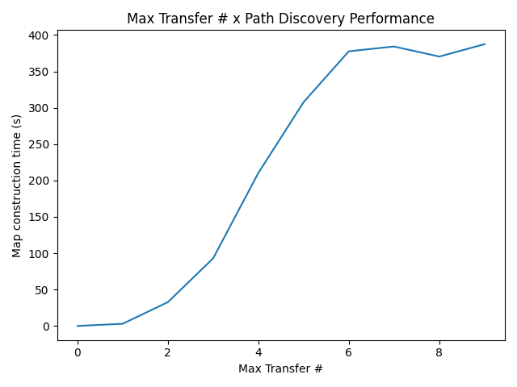
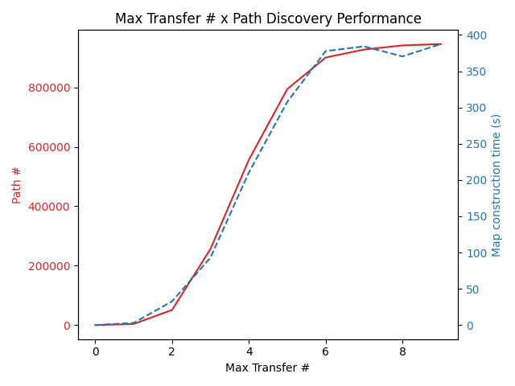
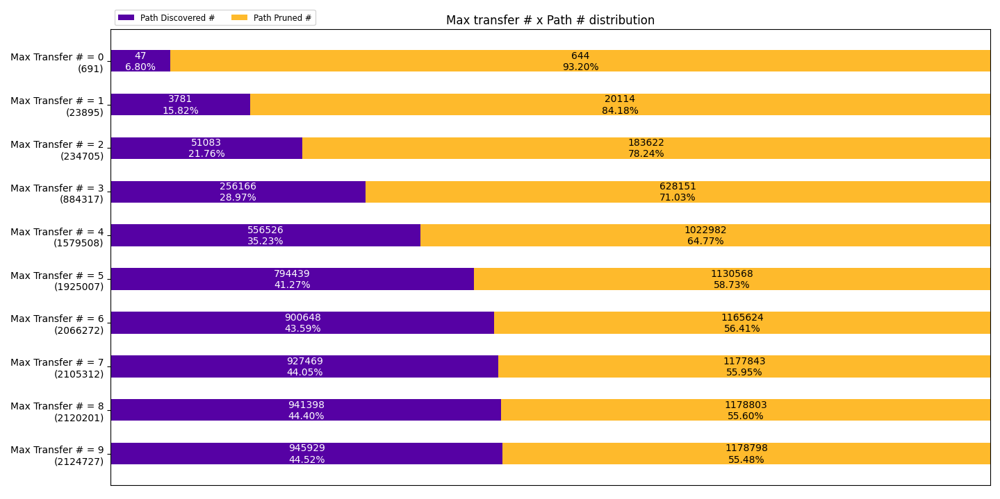
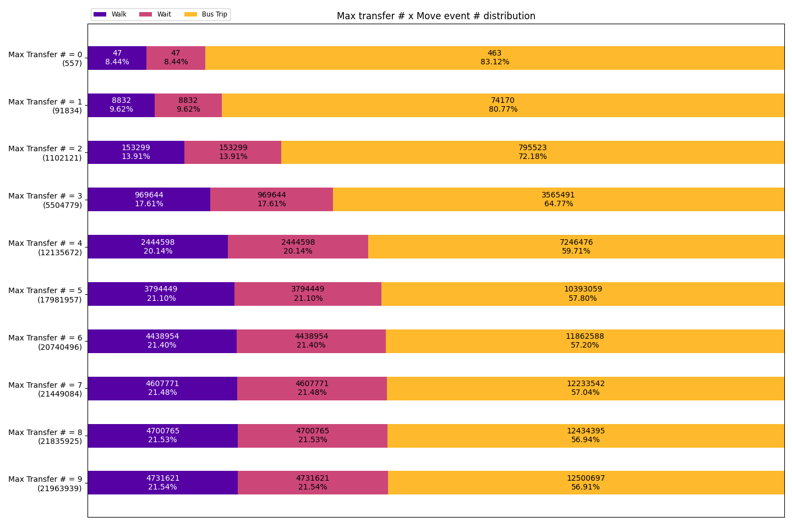

## 2020/11/23

--------

<kbd>BEGIN [Ray][Ray]</kbd>

# Impact on limiting max transfer count

The following performance measurements are based on the following configuration:

- Starting coordinate: `(43.069451, -89.401168)` - Close to Merit Residence Hall of UW-Madison
- Starting time: `2020/09/02 PM 3:00 CDT`
- Walking Speed: `4.2 km/h (2.610 mi)`
- Max. Travel Time: `2700 s (30 mins)`
- Max. Walking Distance: `0.7 km (0.435 mi)`
- Max. Waiting Time: `900 s (15 mins)`
- Non-sense paths are `pruned`
- Detouring paths are `excluded`
  - `traveled distance > displacement x 3` is considered detouring

## Max transfer # x Path discovery performance

This inspects the relationship between the max allowed transfer count and the performance on path discovery.

Doing so allows us to get more insights about how max transfer count will impact the performance (or not).

We can observe that the path discovery time bumps up around max transfer # = 4, 
which we can assume that it is because that most trips takes around 4 transfers, 
with a smaller portion of trips taking 3 ~ 5 transfers.

## Max transfer # x Path #

This inspects the relations ship between the max allowed transfer count and the count of paths.
 
Doing so allows us to know the path space growth rate while we tweak the max allowed transfer count.

Despite that the plot looks similar as the previous one (in terms of change), 
the difference is that this checks for the total path count while the previous one check 
for the transfer count of a single trip.

We can observe that the path count grows rapidly around max transfer # = 4, slows down when max transfer # >= 5.

In fact, after we can overlap the performance plot and this path count plot, 
we observe that the performance growth is synchronized with the path count. 

## Max transfer # x Path # distribution

This inspects the path distribution under different max transfer count.

Doing so allows us to know how much impact the path pruning brings for different max transfer count.

The biggest difference between this plot and the others are that the change are not S-shaped.

In all previous plots, the growth rate (regardless what it is) is fast around max transfer count # = 4, 
and slow for both ends. However, in this plot, 
we instead observe that the rate of path # pruned decreases rapidly until max transfer count # = 6.

We assume that path pruning works more for lower max transfer count #, but less for higher max transfer count #, 
since there are more paths end simply because it reach to the max travel time threshold (or maybe other conditions).

## Max transfer # x Move event distribution

This inspects the relationship between max transfer count and the move event distribution.

Doing so gives us the answer of whether there are a lot of "one-stop bus trips" for higher max transfer count.

We can observe that the distribution gradually becomes stable after max transfer count # = 4.

The ratio of "one-stop bus trips" is expected to be low, 
because there are 2.74 stops for a single bus trip in average 
(sampled using the data of max transfer count # = 4, `10393059/3797449`).

# Summary

We found that the path space (# of paths) are the most direct source of impact on the performance.

We also found that path pruning works more for lower max transfer count.

However, there may be a key that is worth mentioning. Because that we have found max transfer count # = 4 
is the main breakpoint of all the plots, it is highly possible that most of the paths reach the travel time limit 
already at this point. 

If the above holds, the assumption of path pruning will be "not too many paths to be pruned further" 
for max transfer count > 4 instead.

# TODOs

### Prioritized

- Map construction to add all possible next scheduled stops within the waiting timeframe,
  instead of adding the next schedule stop
  
  - A bus of route B coming after a bus of route A is possible. 
    However, the current simulator only consider the route A one.
    
  - Implementations should be added in ``SimulationMap._init_frontier_wait()`` during map generation.

- Allow dummy agents estimation method to be integrated

  - Count the accessed count of a certain coordinate block.
  
  - Needs to use parallelism for optimization.

- Interpolate population data

### Normal

- Plot the area/points reached for a single simulation.

- Same stop transfer only

  - Needs to find which stops share the same route and don't require a lot of wait time (for test).
  
  - Currently, all transfers under T travel = 2700 s w/ Max wait time = 900 s needs walk.

- Calculate the travel experience score for a single path

  - Travel experience score will be determined by bus %, walk %, etc.

- Bottom-up path discovery

  - Despite that this will not return all possible paths, 
    this is especially useful if the path diversity and/or the path itself can be disregarded.
    The following scenarios (including, but not limit to) 
    will get a performance boost without losing any necessary details:
    
    - Getting the accessible areas / farthest traveling displacement or distance

[Ray]: https://github.com/RaenonX
